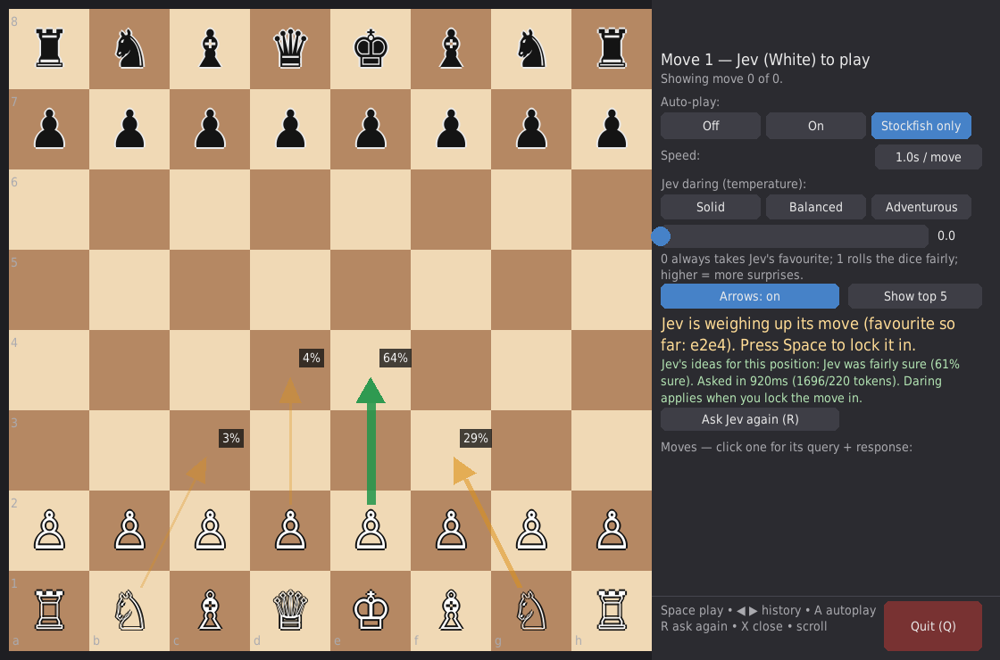
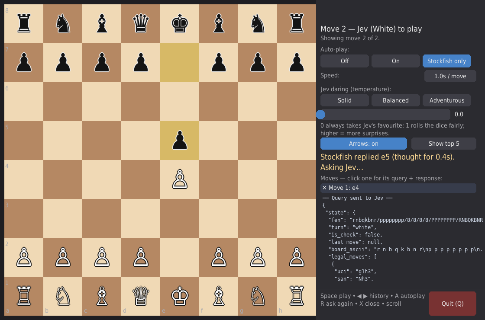

# Jev Chess

Jev (White, via [TypeSafe](https://docs.typesafe.ai)) plays chess against Stockfish (Black, via `python-chess`) in a step-through pygame UI. Watch what Jev is thinking *before* it moves: its candidate moves appear as probability arrows on the board.





## How it works

Jev is a System One model: it can't generate moves, it can only pick from options you give it. So each Jev turn:

1. The board is encoded as JSON state (`fen`, side to move, check status, ASCII board, every legal move with a human-readable description).
2. One `Choice` question asks Jev to pick the best move. The answer is a full probability distribution over the legal moves, plus confidence.
3. The distribution is fetched automatically right after Stockfish moves (one API call, cached per position) and drawn as arrows on the current board.
4. Pressing Space **locks the move in** by sampling the cached distribution with the current daring setting — no second API call.

Daring (temperature) in one function: `0` always takes Jev's favourite, `1` rolls the dice fairly over its distribution, higher is more adventurous (`p ∝ p^(1/T)`).

## Requirements

- Python 3.10+, [uv](https://docs.astral.sh/uv/)
- Stockfish (`sudo apt install stockfish` / `brew install stockfish`)
- A TypeSafe API key in `.env`:
  ```
  TYPESAFE_API_KEY=apikey_...
  ```

## Run

```sh
uv sync
uv run python -m jev_chess.ui_pygame   # GUI (starts in Stockfish-only autoplay)
uv run python -m jev_chess.cli         # terminal fallback
```

Options: `--temperature 0`, `--autoplay off|on|opponent`, `--engine-path …`, `--seed …`.

## UI guide

- **Next move / Space** — lock in Jev's move when its arrows are showing, otherwise play Stockfish's reply.
- **Back / Forward** (arrow keys) — walk through history. Next is locked while viewing an old position.
- **Auto-play** — Off (fully manual), On (both sides), Stockfish only (engine moves itself, Jev waits for Space). Speed 0.5/1/2s.
- **Daring slider + presets** — Solid (0), Balanced (1), Adventurous (1.5). Applies at lock-in.
- **Arrows on/off + top 3/5/8** — width and opacity scale with probability; favourite in green with % labels.
- **Moves list** — one line per move; click to expand the exact Jev query (`state` + `questions`) and response (`answers` + `usage`) as JSON. Stockfish moves show engine detail (score, principal variation, depth). X collapses, wheel scrolls.
- **R** asks Jev again, **A** cycles auto-play, **Q** quits.

## Layout

- `src/jev_chess/game.py` — Jev-White vs Stockfish-Black orchestration, one ply per step.
- `src/jev_chess/jev_player.py` — board → Jev state/criteria encoding, fetch vs sample split.
- `src/jev_chess/sampling.py` — temperature sampling.
- `src/jev_chess/frames.py` — append-only frame history with view cursor (forking deferred).
- `src/jev_chess/board_viz.py` — display-free helpers (arrows, autoplay, wording, JSON formatting).
- `src/jev_chess/ui_pygame.py` / `cli.py` — pygame GUI / terminal UI.
- `FEATURE_PLAN.md` — feature plan and acceptance criteria.

## Tests

```sh
uv run pytest -q
```

## Notes

Jev plays legal but weak chess — it judges positions with common sense, it doesn't search. Expect it to lose to Stockfish; the point is watching *how* it decides.
