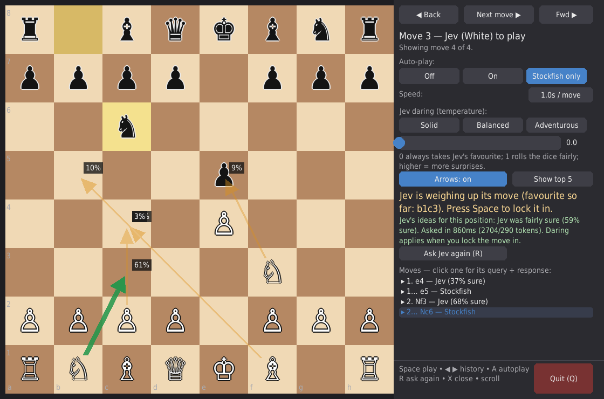

# Jev Chess

> LLM slop disclaimer: this repo was written almost entirely by AI coding agents under loose human supervision. Expect over-engineering, uneven polish, and the occasional confident bad decision. The chess is honest; the code review was not.

Jev (White, via [TypeSafe](https://docs.typesafe.ai)) plays chess against Stockfish (Black, via `python-chess`) in a step-through pygame UI. Watch what Jev is thinking *before* it moves: its candidate moves appear as probability arrows on the board.




## How it works

Jev is a System One model: it picks from options instead of generating text. Each Jev turn sends one `Choice` request and gets back a probability distribution over the legal moves.

State sent (`build_state`, `src/jev_chess/jev_player.py:74`):

```json
{
  "moves_san": ["e4", "e5"],
  "movetext": "1. e4 e5",
  "turn": "white",
  "is_check": false,
  "last_move": "e7e5",
  "board_ascii": "r n b q k b n r\np p p p . p p p\n. . . . . . . .\n. . . . p . . .\n. . . . P . . .\n. . . . . N . .\nP P P P . P P P\nR N B Q K B . R",
  "legal_moves": [
    {"uci": "g1f3", "san": "Nf3", "descr": "Nf3: N g1 to f3, lands on a safe square"}
  ]
}
```

Question sent (`questions = {"move": {instructions, criteria}}`):

```json
{
  "move": {
    "instructions": "Select the move that leads to the best overall future for the side to move...",
    "criteria": {
      "g1f3": "Nf3: N g1 to f3, lands on a safe square",
      "d2d4": "d4: P d2 to d4, lands under attack by 2 (defended by 1)"
    }
  }
}
```

Options are keyed by UCI. Each description carries code-computed consequence flags (`describe_move`, `src/jev_chess/jev_player.py:26`): capture with piece value, promotion, check, castling, en passant, and landing-square danger as attackers vs defenders. The answer returns `choice`, `probabilities`, `confidence`, and token usage.

Flow: the distribution is fetched automatically after Stockfish moves (one call, cached per position; `preview_usable`, `src/jev_chess/board_viz.py:68`) and drawn as arrows. Space samples the cache with the current temperature and locks the move in (`Game.play_white_from_distribution`, `src/jev_chess/game.py:83`), so no second call. Temperature (`src/jev_chess/sampling.py:15`): 0 takes the favourite, 1 samples the raw distribution, higher flattens (`p_T(i) ∝ p_i^(1/T)`). Unknown UCIs fall back to the highest-probability legal move (`resolve_uci`).

## Requirements

- Python 3.10+, [uv](https://docs.astral.sh/uv/)
- Stockfish (`sudo apt install stockfish` / `brew install stockfish`), or pass `--engine-path`
- A TypeSafe API key in `.env` (gitignored, loaded via `python-dotenv`):
  ```
  TYPESAFE_API_KEY=apikey_...
  ```

## Quickstart

```sh
uv sync
uv run python -m jev_chess.ui_pygame   # GUI (starts in Stockfish-only autoplay)
uv run python -m jev_chess.cli         # terminal fallback
uv run pytest -q                       # tests
```

Entry points are also installed as `jev-chess-gui` and `jev-chess` (`pyproject.toml:13`).

Common flags: `--temperature 0`, `--autoplay off|on|opponent` (GUI default `opponent`), `--engine-path …`, `--engine-time …` (0.3s GUI / 0.1s CLI), `--seed …`.

## UI guide

**Buttons / panel**

- **Next move / Space** — when Jev's arrows are showing, locks in Jev's move by sampling the cached distribution; otherwise plays Stockfish's reply. Locked while viewing an old position or when the game is over.
- **Back / Forward** — walk through frame history. Next is locked unless at the tip (prevents accidental branches; forking deferred, `src/jev_chess/frames.py:51`).
- **Auto-play** — `Off` (fully manual), `On` (both sides step automatically), `Stockfish only` (engine moves itself, Jev waits for Space). Speed cycles 0.5 / 1 / 2 s per move.
- **Daring slider (0–2) + presets** — Solid (0), Balanced (1), Adventurous (1.5). Applies at lock-in time, not fetch time, so you can change your mind after seeing the arrows.
- **Arrows on/off + top 3/5/8/Show all** — width and opacity scale with probability; favourite in green with `%` labels. Top-K views hide moves under 1%; Show-all has no cutoff.
- **Moves list** — one line per move with Jev confidence / Stockfish attribution; click to expand the exact Jev query (`state` + `questions`) and response (`answers` + `usage`) as JSON. Stockfish moves show engine detail (score, PV, depth). X or header collapses, mouse wheel scrolls.

**Hotkeys**

| Key | Action |
|-----|--------|
| Space / Enter | Next move (lock in Jev / play Stockfish) |
| ← / → | Back / forward in history |
| A | Cycle auto-play mode |
| R | Ask Jev again (discards cache, costs one API call) |
| X | Close expanded move detail |
| Q / Esc | Quit |
| Mouse wheel | Scroll move list / detail view |

## Project layout

- `src/jev_chess/game.py` — Jev-White vs Stockfish-Black orchestration, one ply per step; per-FEN lock-in via `play_white_from_distribution`.
- `src/jev_chess/jev_player.py` — board → Jev state/criteria encoding, `fetch_distribution` (one API call, no sampling) vs `resolve_uci`/`choose_move` split.
- `src/jev_chess/sampling.py` — temperature sampling (`tempered_distribution`, `sample_move`).
- `src/jev_chess/frames.py` — append-only frame history with view cursor; push requires tip.
- `src/jev_chess/board_viz.py` — display-free helpers (arrows, autoplay decision, wording, JSON formatting) so logic is unit-testable headless.
- `src/jev_chess/ui_pygame.py` / `cli.py` — pygame GUI / terminal UI fallback.
- `tests/` — `test_sampling.py`, `test_frames.py`, `test_board_viz.py`, `test_game_white.py`, `test_jev_query.py`.
- `FEATURE_PLAN.md` — original feature plan and acceptance criteria.

## Testing

```sh
uv run pytest -q
```

Sampling (T=0 argmax, T=1 identity, flatten/sharpen, zeros stay zero, seeded determinism), frame push/navigate/lock rules, arrow ranking/cutoffs, white lock-in from a cached distribution, and Jev query encoding (UCI keys, consequence flags) are covered. GUI rendering is verified headless via dummy SDL (see `FEATURE_PLAN.md`).

## Limitations

Jev plays legal but weak chess — it judges positions with common sense, it does not search or look ahead. Expect it to lose to Stockfish; the point is watching *how* it decides. No PGN export, no takeback/branching (history push requires tip), no eval bar, no ELO strength to speak of.
